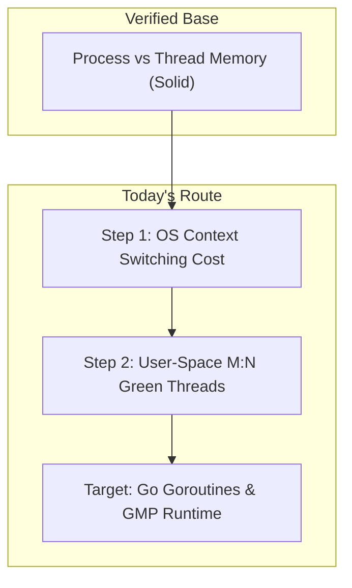
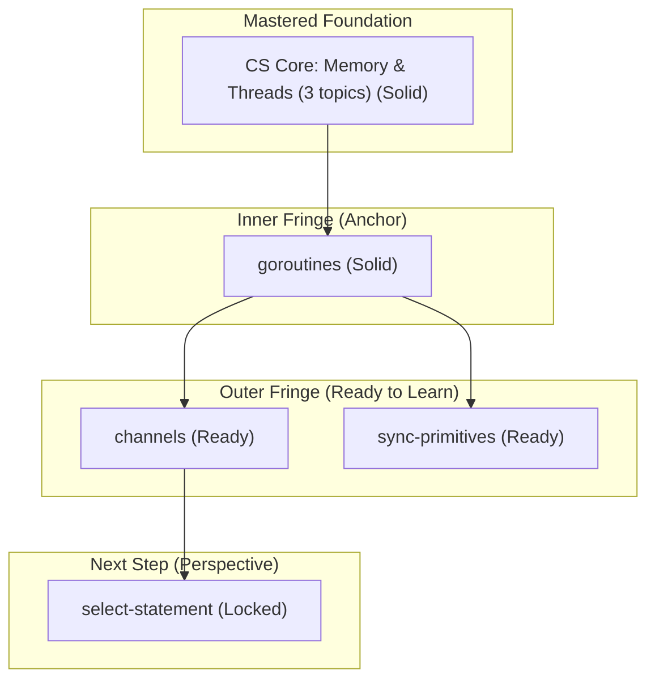
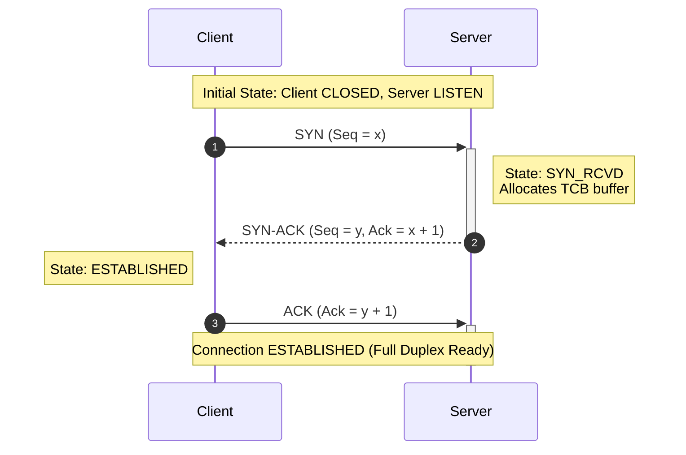
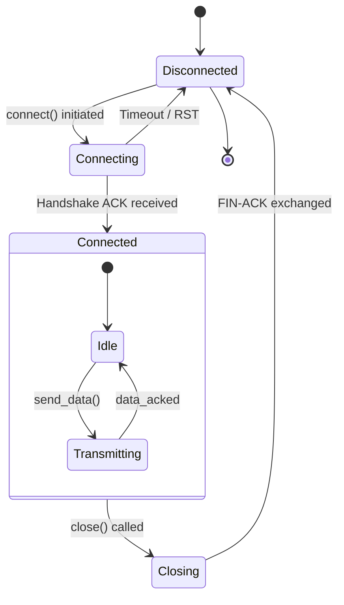
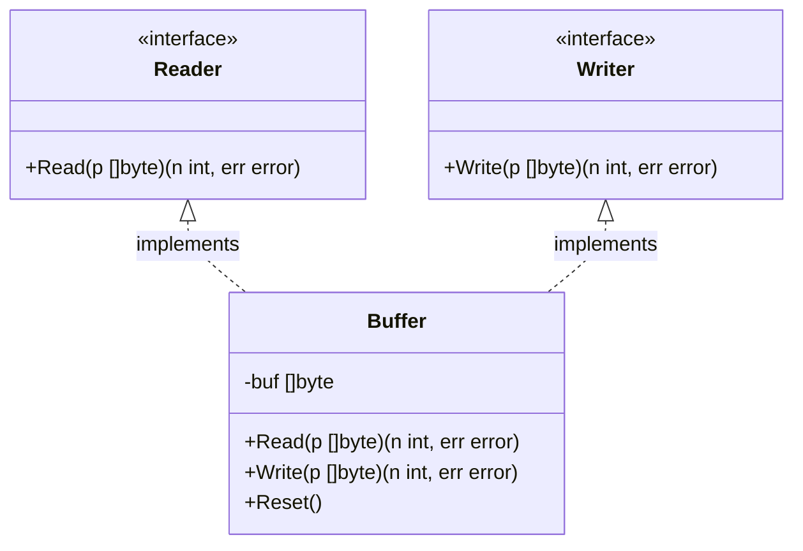
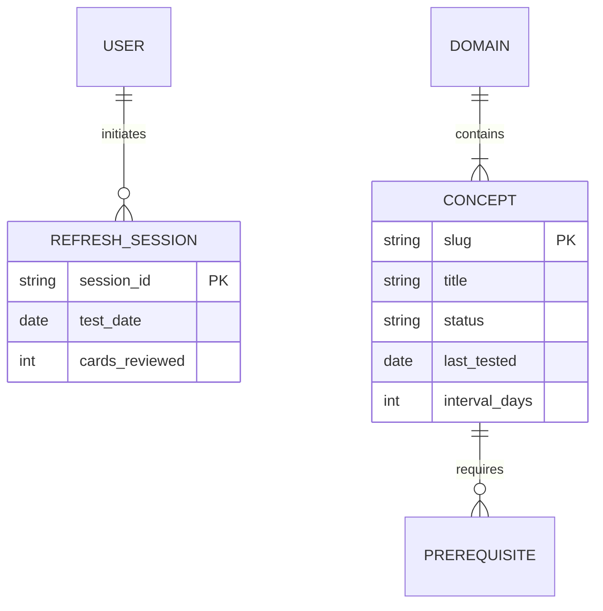

# Visual Architecture & Mathematical Rendering Engine (`visualize`)

This skill defines the technical standards, diagrammatic grammar, and mathematical typesetting protocols for **Antigravity Tutor**. It guarantees that all visual representations—whether rendered dynamically in the chat during lessons or mirrored permanently into the external Obsidian Vault (`sessions/` stream and `knowledge/` garden)—achieve high cognitive compression, zero visual clutter, and 100% parser compatibility.

---

## 1. Core Principles of Cognitive Visualization

Visual models exist to offload working memory, reveal spatial and temporal relationships, and catalyze cognitive compression ("The Click"). A diagram must never be mere decoration.

```
Textual Explanation (Linear)         vs.        Visual Model (Relational / Spatial)
"A depends on B, but B requires C,                 [ C: Primitive Truth ]
 which also branches to D and E..."                         │
                                                   ┌────────┴────────┐
                                                   ▼                 ▼
                                             [ B: Core ]        [ D: Branch ]
                                                   │                 │
                                                   ▼                 ▼
                                             [ A: Target ]      [ E: Leaf ]
```

### When to Visualize (High Cognitive Value)
Render visual diagrams when concepts involve:
1. **Structural Dependency DAGs & Curricula:** Prerequisite hierarchies, knowledge frontiers, multi-step learning trajectories (Phase 2 roadmaps and `_index.md` domain atlases).
2. **Network & Protocol Sequences:** Temporal message exchanges, three-way handshakes, distributed system interactions, request-response lifecycles (`sequenceDiagram`).
3. **State Machines & Transitions:** Finite state automata, lifecycle stages (e.g., process scheduling, connection teardown, transaction states) (`stateDiagram-v2`).
4. **Entity & Relational Architectures:** Database schemas, data structures, component topologies, object graphs (`classDiagram`, `erDiagram`).
5. **Algorithmic & Control Flows:** Branching decision logic, compiler pipelines, data processing pipelines (`flowchart TD` / `flowchart LR`).
6. **Mathematical & Formal Derivations:** Multi-step formula deductions, retention probabilities, geometric and algebraic proofs using KaTeX.

### When NOT to Visualize (Visual Noise & Anti-Patterns)
Do **NOT** generate diagrams for:
* **Trivial Linear Sequences:** A simple 2- or 3-step linear progression with no branching or concurrency (e.g., "Step 1: Download file. Step 2: Open file."). Markdown numbered lists are far more readable.
* **Pure Lexical Definitions:** Single-concept definitions or terminology notes. A single node box with arrows pointing to nothing adds zero value.
* **Superficial "Decoration" Diagrams:** Generic diagrams that merely repeat 3 words without illustrating mechanisms or causal constraints.
* **Monolithic Spaghetti Graphs:** Massive, unpartitioned graphs exceeding 15 nodes. Large graphs induce cognitive overload rather than clarity; partition them into subgraphs or use the Compact Frontier Horizon pattern.

---

## 2. Supported Diagram Types & Specification Standards

Antigravity Tutor exclusively employs native markdown code blocks (` ```mermaid `) that render reliably across both Google Antigravity chat and Obsidian.

### 2.1 Directed Acyclic Graphs (DAGs) and Flowcharts

Used for learning roadmaps, system architectures, pipelines, and causal dependencies.

* **Diagram Types:** `graph TD` (top-down), `graph LR` (left-to-right), `flowchart TD`, `flowchart LR`.
* **Arrow Conventions:**
  * Solid arrow `-->`: Primary dependency, causal consequence, or standard progression.
  * Dotted arrow `-.->`: Soft dependency, optional transition, or conceptual contrast (`contrasted_with`).
  * Thick arrow `==>`: Critical path or active execution boundary.
  * Labeled edge `-->|Condition|`: Branching condition or event trigger.

#### Example: Lesson Roadmap DAG (Phase 2 Plan)


---

### 2.2 The Compact Frontier Horizon Convention (Frontier DAG)

To prevent domain atlas maps (`_index.md`) from degenerating into unreadable web graphs with hundreds of nodes, the knowledge engine enforces the **Compact Frontier Horizon** rule:
* **Node Budget:** Maximum 10–15 active nodes visible at any time.
* **Four Standard Layers:**
  1. **Collapsed Deep Foundation:** Older, fully mastered foundational concepts are collapsed into a single summary node: `CS["Mastered Base (N topics) (Solid)"]`.
  2. **Inner Fringe (Anchor):** Direct prerequisites of the current frontier with verified status: `P1["Prerequisite Topic (Solid)"]` (or `(Shaky)` if flagged).
  3. **Outer Fringe (Frontier / Ready):** Topics whose prerequisites are 100% satisfied, ready for immediate study: `F1["Topic Title (Ready)"]`.
  4. **Next Step (Perspective / Locked):** Direct successors that remain blocked until outer fringe topics are mastered: `L1["Future Topic (Locked)"]`.

#### Canonical Template for `_index.md` Active Horizon


---

### 2.3 Protocol & Message Sequences (`sequenceDiagram`)

Used for network protocols, client-server dialogues, RPCs, concurrent actor messaging, and handshake rituals.

* **Conventions:**
  * Define participants clearly at the top with aliases (`participant C as Client`).
  * Request/sync calls: `->>` (solid arrow with arrowhead).
  * Response/return calls: `-->>` (dashed arrow with arrowhead).
  * Asynchronous/fire-and-forget: `-)` (solid line with open arrow).
  * Use `activate` / `deactivate` (or `+` / `-`) to indicate execution windows.
  * Use `Note over ...` to explain internal state changes or packet flags.

#### Example: TCP Three-Way Handshake


---

### 2.4 State Machines & Lifecycles (`stateDiagram-v2`)

Used for lifecycle states, parser tokens, socket states, and concurrency phases.

* **Conventions:**
  * Prefer `stateDiagram-v2` over legacy `stateDiagram` for improved styling and cleaner syntax.
  * Use `[*]` for entry and termination points.
  * Label transition arrows with the event or guard condition (`--> State : Event [Guard]`).
  * Use composite states (sub-states) for compound statuses.

#### Example: Connection Lifecycle


---

### 2.5 Structural & Relational Modeling (`classDiagram` & `erDiagram`)

Used for data modeling, database design, domain entity relationships, and OOP/interface hierarchies.

#### Class Diagram (Interfaces and Structs)


#### Entity-Relationship Diagram (Relational Schemas)


---

## 3. Strict Obsidian Compatibility Rules

Obsidian bundles its own parser for Mermaid. Syntax errors that work in loose web previews will break completely inside Obsidian Vaults. All generated diagrams **must strictly adhere** to these compatibility constraints:

### Rule 1: Zero Wikilinks Inside Mermaid Node Labels
* **FATAL ERROR:** Never write wiki-brackets `[[...]]` inside Mermaid node identifiers or labels.
  ```mermaid
  %% WRONG - BREAKS OBSIDIAN PARSER COMPLETELY:
  %% node1["[[goroutines]] (Solid)"]
  ```
* **CORRECT PATTERN:** Always use clean, plain text for labels:
  ```mermaid
  %% CORRECT:
  node1["goroutines (Solid)"]
  ```
* **How to link:** In domain `_index.md` files, place wikilinks in the Markdown list registry outside the Mermaid code block:
  ```markdown
  ## 3. Concept Registry
  - [[goroutines]] — Goroutines are multiplexed across OS threads via M:N model `[Solid]`
  - [[channels]] — Channels provide typed communication and synchronization `[Ready]`
  ```

### Rule 2: Quote All Node Labels with Special Characters
* If a node label contains parentheses `()`, brackets `[]`, braces `{}`, colons `:`, commas `,`, slashes `/`, or spaces, **always enclose the label string in double quotes**:
  * Correct: `id["Topic (Solid)"]`
  * Correct: `cs["Memory: Stack vs Heap"]`
  * Broken: `id[Topic (Solid)]` (parentheses inside unquoted brackets cause syntax failure)

### Rule 3: Avoid Raw HTML Inside Node Labels
* Do not inject raw HTML tags like `<br>`, `<b>`, `<i>`, or `<span>` into Mermaid node labels unless strictly necessary.
* For multiline node labels, use standard Mermaid string breaks `\n`:
  * Correct: `n1["Phase 1: Adaptive Probe\nCalibrating Frontier"]`
  * Avoid: `n1["Phase 1: Adaptive Probe<br>Calibrating Frontier"]`

### Rule 4: Valid Link Arrows Only
* Use only standard, supported Mermaid arrow forms:
  * Standard: `-->`
  * Labeled: `-->|label|`
  * Dotted: `-.->`
  * Dotted labeled: `-.->|label|`
  * Thick: `==>`
  * Thick labeled: `==>|label|`
* Do not invent non-standard lengths or characters (e.g., `--->`, `===>`, `-->?`).

### Rule 5: Quoting Subgraph Titles
* Always quote subgraph titles to accommodate spaces and punctuation:
  ```mermaid
  subgraph "Inner Fringe (Anchor)"
      nodeA["Concept A (Solid)"]
  end
  ```

### Rule 6: Stick to Universally Supported Diagram Types
* The following diagram types are fully verified across Obsidian and Antigravity:
  * `flowchart TD` / `flowchart LR` / `graph TD` / `graph LR`
  * `sequenceDiagram`
  * `stateDiagram-v2` / `stateDiagram`
  * `classDiagram`
  * `erDiagram`
  * `xychart-beta`
* Do **NOT** use experimental diagram types (e.g., Gantt charts, Mindmaps, Timelines, GitGraphs, or Pie charts), as their rendering is fragile, inconsistently supported across mobile/desktop Obsidian engines, and hard to read in chat streams. Use flowcharts or structured markdown tables instead.

---

## 4. Mathematical Typesetting Standard (KaTeX / LaTeX)

Both the Antigravity chat interface and Obsidian support mathematical typesetting via **KaTeX**. Adhere strictly to the following formatting standards:

### 4.1 Inline Mathematics
* Delimit inline math with single dollar signs: `$formula$`.
* **Zero Whitespace Rule:** Never leave a whitespace immediately after the opening `$` or before the closing `$`.
  * Correct: `$R = 2^{-\frac{\Delta t}{I}}$`
  * Broken: `$ R = 2^{-\frac{\Delta t}{I}} $`
* Use inline math for mathematical variables, formulas, bounds, and Big-O notation:
  * Complexity: `$O(n \log n)$`, `$O(1)$`
  * Probabilities and variables: `$P(A \mid B)$`, `$x \in \mathbb{R}$`
  * Spaced repetition: `$R \ge 0.5$`, `$I_{new} = \text{round}(I \times 2.2)$`

### 4.2 Display / Block Equations
* Place display equations inside double dollar signs `$$...$$` on dedicated, isolated lines with surrounding blank lines:
  ```latex
  $$
  R = 2^{-\frac{\Delta t}{I}}
  $$
  ```
* For multi-step derivations or aligned equations, use the `aligned` environment:
  ```latex
  $$
  \begin{aligned}
  f'(x) &= \lim_{\Delta x \to 0} \frac{f(x + \Delta x) - f(x)}{\Delta x} \\
        &= \lim_{\Delta x \to 0} \frac{(x + \Delta x)^2 - x^2}{\Delta x} \\
        &= \lim_{\Delta x \to 0} (2x + \Delta x) = 2x
  \end{aligned}
  $$
  ```

### 4.3 Protection of Literal Dollar Signs
* In standard markdown, two unescaped dollar signs in a paragraph turn everything between them into an unintentional math formula.
* **Currency Rule:** Always escape literal currency dollars:
  * Write `\$100` or `\$500/month`, never `$100` or `$500`.
* **Shell & Code Variables:** Always enclose code variables, environment variables, or shell parameters in backticks:
  * Write `$PATH`, `$USER`, `$1`, never raw `$PATH`.

### 4.4 Typographical Best Practices
* Use `\text{...}` for descriptive words or units inside formulas:
  * Correct: `$$ \Delta t = t_{\text{now}} - t_{\text{last}} \quad [\text{days}] $$`
  * Avoid: `$$ \Delta t = t_{now} - t_{last} $$` (italicizes "now" and "last" as products of variables)
* Use standard relational and operator macros:
  * `\le` ($\le$) and `\ge` ($\ge$) instead of `<=` and `>=`.
  * `\times` ($\times$) instead of `*` for multiplication.
  * `\cdot` ($\cdot$) for dot products or scalar multiplication.

---

## 5. Dynamic Language Mirroring for Visual Artifacts

While this skill definition and all internal repository code are maintained strictly in **English**, all visual diagrams and mathematical annotations generated for the user must **dynamically mirror the user's active conversational language**:

| Component | When User Speaks Russian | When User Speaks English |
| :--- | :--- | :--- |
| **Collapsed Foundation** | `CS["Освоенный фундамент (3 темы) (Solid)"]` | `CS["Mastered Base (3 topics) (Solid)"]` |
| **Inner Fringe Subgraph** | `subgraph "Inner Fringe (Опора)"` | `subgraph "Inner Fringe (Anchor)"` |
| **Outer Fringe Subgraph** | `subgraph "Outer Fringe (Готово к изучению)"` | `subgraph "Outer Fringe (Ready to Learn)"` |
| **Next Step Subgraph** | `subgraph "Next Step (Перспектива)"` | `subgraph "Next Step (Perspective)"` |
| **Sequence Diagram Notes** | `Note right of S: Выделение буфера сокета` | `Note right of S: Allocates socket buffer` |
| **State Machine Events** | `Connecting --> Connected : Получен SYN-ACK` | `Connecting --> Connected : SYN-ACK received` |

*Note: Technical protocol acronyms (`SYN`, `ACK`, `TCP`, `GMP`, `CSP`), mathematical variable symbols (`$R$`, `$\Delta t$`), and code identifiers (`netpoller`, `epoll`) remain in their canonical technical form across all languages.*

---

## 6. Pre-Flight Diagram Quality Checklist

Before finalizing any diagram or equation in a chat message or writing to an Obsidian note file, run this mental verification:

- [ ] **Cognitive Necessity:** Does this diagram genuinely clarify a structure, sequence, or state, or could it be stated in one sentence?
- [ ] **Node Count:** Is the active node count within the 10–15 node budget?
- [ ] **Zero Wikilinks:** Are all Mermaid node labels completely free of `[[...]]` brackets?
- [ ] **Quoted Labels:** Are all labels with parentheses, brackets, colons, or spaces safely enclosed in double quotes?
- [ ] **Valid Types:** Is the diagram type on the supported list (`flowchart`, `graph`, `sequenceDiagram`, `stateDiagram-v2`, `classDiagram`, `erDiagram`)?
- [ ] **KaTeX Delimiters:** Are inline math blocks formatted without internal whitespace (`$x$`) and equations cleanly isolated (`$$...$$`)?
- [ ] **Escaped Literals:** Are currency symbols escaped (`\$`) and shell variables wrapped in backticks?
- [ ] **Language Consistency:** Do the node labels, subgraphs, and sequence notes match the language the learner is currently speaking?
