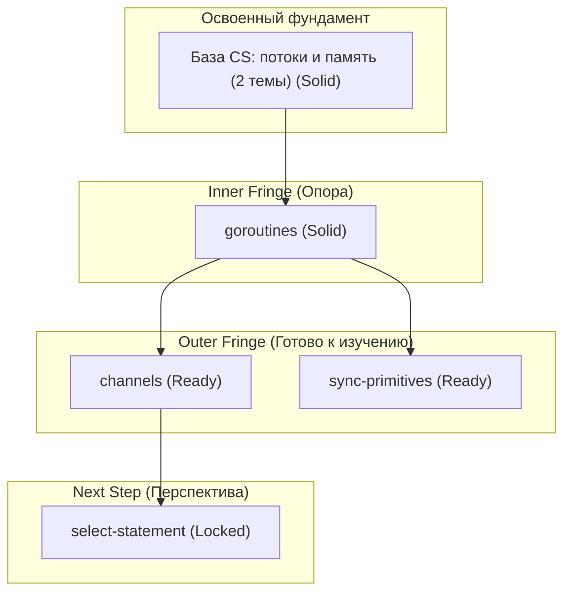
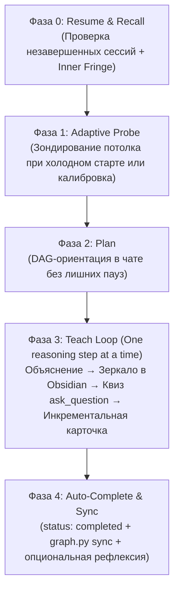

# Концепция и Спецификация Системы Обучения: Antigravity Tutor

> Архитектурная спецификация системы глубокого обучения для **Google Antigravity**, основанной на педагогических принципах Амоса Блумквиста (*How I Use AI to Learn Things*), теории пространств знаний (*Knowledge Space Theory*), концепт-картах Джозефа Новака и принципах *Evergreen Notes* Энди Матушака.

---

## 1. Миссия и Философия

Цель системы — превратить AI-агента в персонального сократического ментора, исключающего пассивное заучивание и формирующего в памяти ученика **связную, самоподдерживающуюся сеть понятий**.

### Два незыблемых педагогических принципа
1. **Принцип I — Безусловные истины в фундаменте (Unconditional Truths First):**
   Обучение начинается с неоспоримых, свободных от оговорок фактов (аксиом, универсальных утверждений, строгих определений). Мозг мгновенно принимает их, потому что ничто более фундаментальное не сможет их опровергнуть.
2. **Принцип II — Мотивированное открытие («Как я сам мог до этого додуматься?»):**
   Факты не декларируются сверху. Каждый шаг вывода мотивирован проблемой, которая заставила исследователей изобрести этот метод (стиль Гранта Сандерсона / 3Blue1Brown).

> **Понимание $\neq$ заучивание.** Заученные факты «гниют». Понятые факты выводятся из фундамента и сохраняются за счёт связей в графе.

---

## 2. Двухуровневая Архитектура Данных (Stream vs. Garden)

Система устраняет «синдром мусорного ящика» (junk drawer) и фрагментацию за счёт строгого разделения на два контура.

Хранилище (`my-learning-vault/`) является внешней директорией Obsidian Vault, путь к которой настраивается в локальном `config.json`. Это позволяет подключать любые существующие хранилища Obsidian, иметь несколько разных баз знаний и держать код системы полностью отделённым от личных заметок:

```text
my-learning-vault/
├── sessions/                       # Контур 1: Stream (Поток / Журнал сессий)
│   ├── 2026-10-03-tcp-basics.md
│   └── 2026-10-04-go-concurrency.md
│
└── knowledge/                      # Контур 2: Garden (Кристаллизованный граф)
    ├── cs-foundations/             # Ядро Computer Science (общие корни)
    │   ├── _index.md
    │   └── memory-stack-vs-heap.md
    │
    ├── math/                       # Мета-домен «Математика» (составные разделы со своими DAG)
    │   ├── _index.md               # Макро-карта: как разделы математики связаны между собой
    │   ├── linear-algebra/         # Раздел: Линейная алгебра
    │   │   ├── _index.md           # Мезо-карта: локальный DAG линейной алгебры
    │   │   └── vector-spaces.md    # Микро-карточка концепта
    │   ├── calculus/               # Раздел: Математический анализ
    │   │   ├── _index.md           # Мезо-карта: локальный DAG матана
    │   │   └── derivatives.md
    │   └── probability/            # Раздел: Теория вероятностей
    │       └── _index.md
    │
    ├── languages/                  # Мета-домен языков программирования
    │   ├── go/
    │   │   ├── _index.md
    │   │   ├── goroutines.md
    │   │   └── channels.md
    │   └── js/
    │       ├── _index.md
    │       └── event-loop.md
    │
    └── backend/                    # Архитектура и прикладные системы
        ├── _index.md
        └── database-indexing.md
```

### Контур 1: `sessions/` (Журнал сессий — Live Stream)
* **Живое зеркалирование (Live Mirroring):** Запись ведётся в реальном времени. На каждом шаге рассуждения агент дописывает объяснение, формулы и квизы в конец файла сессии.
* **Чтение с экрана Obsidian:** Пользователь держит Obsidian открытым рядом с чатом и читает урок в реальном времени с идеальным рендерингом типографики, математики $\LaTeX$ и диаграмм.
* **Статусы сессии в frontmatter:**
  - `status: in_progress` — сессия идёт прямо сейчас.
  - `status: completed` — все намеченные цели достигнуты (выставляется автоматически сразу после кристаллизации последней карточки).
  - `status: paused` — сессия прервана пользователем («продолжим завтра»).

### Контур 2: `knowledge/<domain>/` (Атлас и Граф знаний)
* Долговечная структура вне времени (*timeless, low-entropy*).
* Состоит из **Карточек Концептов** (`<concept-slug>.md`) и **Карт Доменов** (`_index.md`).
* **Инкрементальная кристаллизация:** Карточка концепта создаётся **сразу же**, как только отдельный узел понят и подтверждён квизом на шаге рассуждения (не дожидаясь финала всей сессии). Если урок прервётся — усвоенные знания уже надёжно сохранены.
* **Паттерн «Мета-домен» для крупных наук (Математика, Языки):**
  Крупные дисциплины декомпозируются на разделы со своими локальными DAG-графами (`math/linear-algebra/`, `math/calculus/`):
  - **Микро (Концепт):** Карточка одного понятия (`derivatives.md`).
  - **Мезо (Раздел):** Карта раздела (`math/calculus/_index.md`) с обозримым DAG.
  - **Макро (Дисциплина):** Главная карта (`math/_index.md`), показывающая стыки между разделами.
* **Just-In-Time создание:** Папки доменов и файлы `_index.md` создаются на лету, только когда пользователь впервые изучает концепт из этой области. Никаких пустых папок-призраков.

---

## 3. Анатомия Карточки Концепта (`<concept-slug>.md`)

В каждой карточке строго разграничены:
- **Заголовок по Матушаку:** декларативный тезис-вывод (что доказали).
- **Тело заметки по Амосу:** цепочка *«Фундамент $\to$ Проблема $\to$ Решение $\to$ Различение»*.
- **Файловый слаг:** короткий, безопасный путь (например, `goroutines.md`).

### Эталонный шаблон карточки
```markdown
---
id: goroutines                      # чистый слаг карточки (без префикса домена)
title: "Горутины мультиплексируются планировщиком Go по потокам ОС через модель M:N"
domain: languages/go
status: solid                       # solid | shaky
last_tested: 2026-10-04
interval_days: 7                    # растёт при успехе: 3 -> 7 -> 16 -> 35 -> 90

# Связи графа (Core 4)
depends_on:
  - "[[concurrency-models]]"
  - "[[memory-stack-vs-heap]]"
part_of:
  - "[[languages/go/_index]]"
contrasted_with:
  - "[[languages/js/event-loop]]"
solves:
  - "Дороговизна переключения контекста и размер стека потоков ОС (2 МБ vs 2 КБ)"
refines: []
---

# Горутины мультиплексируются планировщиком Go по потокам ОС через модель M:N

### 1. Фундамент (Безусловные истины)
Поток операционной системы (kernel thread) дорог в создании и требует фиксированного стека памяти (обычно 1–2 МБ). Переключение контекста между потоками ОС требует перехода в режим ядра (syscall / kernel trap).

### 2. Мотивация (Какую проблему решаем?)
При сетевом вводе-выводе с миллионом одновременных подключений (C10K/C1000K) выделение потока ОС на каждое соединение приводит к исчерпанию оперативной памяти и деградации производительности из-за переключения контекстов.

### 3. Вывод и механизм
Go Runtime реализует кооперативную модель $M:N$ прямо в пространстве пользователя (user-space):
- Горутина стартует с сегментируемым стеком размером всего в 2 КБ.
- Планировщик (GMP-модель) мультиплексирует $M$ горутин на $N$ системных потоков ОС.
- При блокировке на сетевом сокете горутина усыпляется в `netpoller`, освобождая системный поток для выполнения других задач.

### 4. Различение и ловушки (С чем не путать?)
- **В отличие от Event Loop (JS):** Горутины дают полноценный параллелизм на нескольких ядрах процессора без необходимости плодить отдельные процессы.
- **Ловушка:** Длинный синхронный вычислительный цикл без вызовов функций может задержать кооперативное переключение, если не сработает прерывание по таймеру (preemption).

### 5. Сессии
- Разбор: [[2026-10-04-go-concurrency]]
```

---

## 4. Карта Предметной Области (`_index.md`) и Горизонт Графа

Каждый домен содержит индексный файл с локальным графом зависимостей (DAG).

### Структура `_index.md`:
Файл состоит из двух частей:
1. **Planned Curriculum (Учебный план домена):** дорожная карта тем раздела с их зависимостями. Формируется и органически доращивается агентом по мере изучения предмета.
2. **Auto-Generated Horizon (Вычисляемый горизонт):** блок Mermaid и реестр, автоматически обновляемый скриптом `graph.py sync` строго между тегами-маркерами (чтобы не затирать план).

### Принцип компактного горизонта (Frontier Horizon):
Чтобы диаграмма Mermaid не превращалась в нечитаемую «паутину» на сотни строк, в ней отображаются только **3 активных слоя (10–15 узлов максимум)**:
1. **Глубокий фундамент (свёрнут):** Давно освоенные узлы схлопываются в единый суммирующий узел `[Освоенный фундамент (N тем)]`.
2. **Inner Fringe (Опора):** Непосредственные пререквизиты текущих тем со статусом `(Solid)`.
3. **Outer Fringe (Фронтир / Зона ближайшего развития):** Концепты, у которых закрыты все пререквизиты, помеченные как `(Ready)`.
4. **Next Horizon (1 шаг вперёд):** Ближайшие заблокированные цели `(Locked)`.
* Внутри меток узлов Mermaid используется чистый текст без скобок `[[...]]`, чтобы исключить сбои рендеринга.

```markdown
---
domain: languages/go
title: "Карта знаний: Язык программирования Go"
---

# Карта знаний: Язык программирования Go

## 1. Дорожная карта раздела (Planned Curriculum)
- id: goroutines
  depends_on: [concurrency-models, memory-stack-vs-heap]
- id: channels
  depends_on: [goroutines]
- id: sync-primitives
  depends_on: [goroutines]
- id: select-statement
  depends_on: [channels]

<!-- AUTO-GENERATED HORIZON START -->
## 2. Активный горизонт графа (Frontier DAG)


## 3. Реестр концептов домена
- [[goroutines]] — Горутины мультиплексируются планировщиком Go по потокам ОС через модель M:N `[Solid]`
- [[channels]] — Каналы обеспечивают синхронизацию через передачу владения данными (CSP) `[Ready]`
<!-- AUTO-GENERATED HORIZON END -->
```

---

## 5. Полный Цикл Сессии (Lifecycle: One Reasoning Step at a Time)



### Фаза 0: Resume & Recall (Вход, возобновление и воспоминание)
1. **Проверка прерванных сессий:** Агент проверяет `sessions/` в этом домене. Если есть сессия со статусом `in_progress` или `paused`, агент предлагает продолжить с места остановки.
2. **Проверка опоры (Inner Fringe):** 
   - Агент задаёт **ровно 1 глубокий концептуальный вопрос** по каждому непосредственному родителю на фронтире.
   - Если ответ уверенный — фундамент подтверждён. Если есть легкое сомнение — агент задает 1 контрольный уточняющий микро-вопрос для исключения случайного угадывания.
3. **Протокол забытых пререквизитов (Branching Protocol):** Если выясняется, что база просела:
   - Карточка родителя в графе помечается `status: shaky`.
   - Агент честно предлагает развилку через `ask_question`:
     * *Вариант А (Ветвление):* 7–10 минутный мини-урок для полноценного восстановления фундамента в графе (`solid`).
     * *Вариант Б (Аналогия):* Понятная практическая аналогия «на пальцах», чтобы не отвлекаться от сегодняшней главной цели.

### Фаза 1: Adaptive Probe (Калибровка границы)
1. **Холодный старт (новый домен с нуля):** Агент проводит адаптивный бинарный поиск из **3–5 градуированных вопросов** в Quiz Mode (с обязательным пунктом `"I don't know"`). При первом же сигнале пробела опрос останавливается — потолок найден.
2. **Тёплый старт (продолжение знакомого предмета):** Бинарный поиск пропускается (уровень виден по графу). Агент задает только 1 вопрос по цели урока, если она не была указана в команде.

### Фаза 2: Plan (Маршрут и ориентирование)
1. **Фактчекинг:** Агент перепроверяет формулы и определения (при сомнении — через субагента `research`).
2. **DAG-ориентация:** Агент выводит схему маршрута из 2–3 шагов в сессионный файл и в чат, чтобы ученик видел дорогу.
3. **Бесшовный переход:** Агент **не делает паузу и не требует одобрения плана** (ученик не может квалифицированно судить о незнакомой теме). Агент сразу же переходит к Шагу 1.

### Фаза 3: Teach Loop («One reasoning step at a time»)
Агент строго следует принципу одного логического шага за раз:
1. **Квант рассуждения:** Агент формулирует проблему, мотивирует решение и объясняет один шаг (в стиле 3Blue1Brown).
2. **Live Mirroring:** Текст рассуждения, формулы $\LaTeX$ или схемы немедленно дописываются в конец файла `sessions/<date>-<topic>.md`. Ученик читает в Obsidian.
3. **Метроном понимания (`ask_question`):** Агент **сразу же** задаёт интерактивный квиз по только что объяснённому шагу (4 параллельных варианта + *"I don't know"* + поле для своей мысли).
4. **Мгновенная обратная связь и защита от «песка»:**
   - Если ответ правильный: подтверждение сути $\to$ следующий шаг.
   - **Если ответ `"I don't know"` или неверный:** агент **НЕ идет дальше**! Он перестраивает объяснение (другая метафора, разбиение на полушаги), задаёт **другой проверочный вопрос** и только после подтверждения понимания двигается вперёд.
5. **Инкрементальная кристаллизация:** Как только отдельный концепт полностью закрыт, агент **сразу же** сохраняет его карточку в `knowledge/<domain>/<slug>.md`.

### Фаза 4: Auto-Complete & Sync (Завершение и валидация)
1. **Авто-завершение:** Сессия переводится в `status: completed` (строка метаданных в шапке заметки сессии обновляется) автоматически сразу после кристаллизации последней карточки.
2. **Опциональная рефлексия:** Агент предлагает сформулировать суть урока в одном предложении (если ученик торопится и закрыл окно — урок всё равно уже сохранён и закрыт).
3. **Синхронизация:** Агент вызывает команду валидации графа:
   ```bash
   python3 scripts/graph.py sync --domain <domain>
   ```
   Скрипт проверяет граф на циклы (алгоритм Тарьяна) и обновляет блок между маркерами в `_index.md`.

---

## 6. Механика Умного Освежения Памяти: `/refresh` и Алгоритм FIRe

Система категорически исключает принудительный «Review Hell» (накапливание сотен карточек, вызывающее стресс и чувство вины):

1. **Режим `/refresh` строго опционален:** Никаких обязательных счетчиков долга. 
2. **Лимит сессии (Review Cap):** За одну сессию `/refresh` система выдает **строго 3–5 карточек** (не более 5 минут).
3. **Топологический приоритет (Hub Priority):** Первыми для освежения выбираются концепты-«хабы», находящиеся в критической зоне забывания, от которых зависит больше всего последующих узлов.
4. **Практический FIRe 1-го порядка:** Когда на уроке успешно освоен концепт $B$, его **прямой родитель $A$ автоматически получает `last_tested: сегодня`**.
5. **Три предохранителя от иллюзии понимания:**
   * Интервалы не замораживаются навечно — счетчик продолжает тикать.
   * Фаза 0 всегда проверяет острую базу перед стартом новой надстройки.
   * `/refresh` проверяет корни и хабы, а не верхушки веток.
6. **Протокол мягкой посадки (Amnesia Protocol):** Если перерыв в занятиях составил более 30–45 дней, агент не устраивает экзамен, а задает 1–2 макро-вопроса для мягкой реактивации ментальных моделей.

---

## 7. Команды Системы и Интеграция с Google Antigravity

### Пользовательские команды
* **`/teach <topic>`** — начать или продолжить изучение темы.
* **`/refresh [domain]`** — добровольная 5-минутная разминка для ума по изученным темам.
* **`/status`** — показать текущий фронтир знаний и статистику.

### Декларативное взаимодействие с инструментами Antigravity
* **Интерактивные квизы:** Задаются через модальное окно выбора (`ask_question` в Quiz Mode с дистракторами и кнопкой `I don't know`).
* **Live Mirroring:** Дописывание текста шагов рассуждений в конец файла сессии в реальном времени.
* **Обновление метаданных:** Точечная замена строки статуса в заголовке заметки сессии по завершении урока (`status: in_progress` $\to$ `status: completed`).
* **Визуализация:** Нативный рендеринг блоков ` ```mermaid ` прямо в чате, Obsidian и Markdown-артефактах.
* **Математика:** Нативный рендеринг KaTeX ($\LaTeX$) в чате и заметках (`$...$` и `$$...$$`).
* **Исследование:** Вызов субагента `research` для фактчекинга определений и формул.
* **Валидация графа:** Вызов `scripts/graph.py sync` для проверки ацикличности (алгоритм Тарьяна) и обновления активного горизонта.
