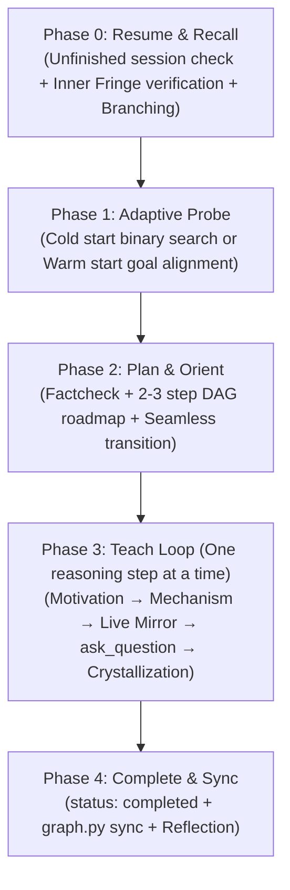

# Antigravity Tutor

**Autonomous Socratic Deep-Learning Mentor for Google Antigravity & Obsidian.**

> Teaching loop adapted from [amosblomqvist/learn](https://github.com/amosblomqvist/learn).

[](https://www.python.org/downloads/)
[](https://obsidian.md/)
[](https://antigravity.google)

---

## Table of Contents

- [1. Overview & Core Features](#1-overview--core-features)
- [2. Two-Tier Data Architecture (Stream vs. Garden)](#2-two-tier-data-architecture-stream-vs-garden)
  - [Decoupled Vault Model](#decoupled-vault-model)
  - [Tier 1: Stream (`sessions/`)](#tier-1-stream-sessions)
  - [Tier 2: Garden (`knowledge/`)](#tier-2-garden-knowledge)
  - [Anatomy of an Evergreen Concept Card](#anatomy-of-an-evergreen-concept-card)
  - [Domain Atlas Maps (`_index.md`)](#domain-atlas-maps-_indexmd)
- [3. Quick Start & Setup](#3-quick-start--setup)
  - [Prerequisites](#prerequisites)
  - [Installation](#installation)
  - [Configuring the Obsidian Vault Path](#configuring-the-obsidian-vault-path)
- [4. Supported Slash Commands](#4-supported-slash-commands)
  - [`/teach <topic>`: The 5-Phase Teaching Lifecycle](#teach-topic-the-5-phase-teaching-lifecycle)
  - [`/refresh [domain]`: High-Efficiency Active Recall Workout](#refresh-domain-high-efficiency-active-recall-workout)
  - [`/status`: Knowledge Frontier & Retention Dashboard](#status-knowledge-frontier--retention-dashboard)
- [5. Obsidian Vault Setup & Best Practices](#5-obsidian-vault-setup--best-practices)
  - [Graph View Configuration](#graph-view-configuration)
  - [Dataview Community Plugin Integration](#dataview-community-plugin-integration)
- [6. CLI Engine Reference (`scripts/graph.py`)](#6-cli-engine-reference-scriptsgraphpy)
  - [`sync`](#sync)
  - [`refresh`](#refresh)
  - [`status`](#status)
  - [`new-session`](#new-session)
  - [`update-card`](#update-card)
- [7. Repository Structure](#7-repository-structure)

---

## 1. Overview & Core Features

**Antigravity Tutor** transforms [Google Antigravity](https://antigravity.google) into a personalized, autonomous Socratic mentor. Rather than dumping passive lecture monologues, it guides you through concepts step by step and builds a persistent, self-reinforcing dependency graph of knowledge directly in your personal [Obsidian](https://obsidian.md/) vault.

| Traditional AI Tutoring | Antigravity Tutor |
| :--- | :--- |
| **Passive Lecture Monologues** | **Socratic Cadence:** Advances "one reasoning step at a time" with interactive comprehension quizzes. |
| **Rote Fact Memorization** | **Motivated Discovery:** Explores the causal problem first (*"Why did existing approaches fail? What forced this invention?"*). |
| **Ephemeral Chat Logs** | **Two-Tier Obsidian Vault:** Live session journals (`sessions/`) and permanent concept cards (`knowledge/`). |
| **Spaced Repetition Overload** | **Targeted `/refresh`:** 5-minute active recall workouts (3–5 cards) prioritized by dependency topology and forgetting curves. |

---

## 2. Two-Tier Data Architecture (Stream vs. Garden)

To eliminate the "junk drawer" syndrome that plagues personal knowledge bases, Antigravity Tutor strictly separates transient session logs from timeless, crystallized mental models.

```text
<vault_path>/
├── sessions/                       # Tier 1: Stream (Live Session Journal)
│   ├── 2026-10-03-tcp-basics.md
│   └── 2026-10-04-go-concurrency.md
│
└── knowledge/                      # Tier 2: Garden (Crystallized Knowledge Graph)
    ├── cs-foundations/             # Core Computer Science roots
    │   ├── _index.md
    │   └── memory-stack-vs-heap.md
    │
    ├── languages/go/               # Domain: Go Programming
    │   ├── _index.md               # Domain Atlas Map (Curriculum + Active Frontier DAG)
    │   ├── goroutines.md           # Evergreen Concept Card
    │   └── channels.md
    │
    └── backend/                    # Systems & Databases
        ├── _index.md
        └── database-indexing.md
```

### Decoupled Vault Model

The tutor engine code (`antigravity-tutor/`) is fully decoupled from personal notes. The knowledge base resides in an external Obsidian Vault of your choice, specified in `config.json`. You can point the tutor to any existing or new vault without polluting the codebase.

### Tier 1: Stream (`sessions/`)

- **Live Mirroring:** As the tutor explains each reasoning quantum, KaTeX formulas, and diagrams, it concurrently appends them in real time to `<vault_path>/sessions/YYYY-MM-DD-<topic>.md`.
- **Side-by-Side Reading:** Keep Obsidian open next to your Antigravity chat window to read the beautifully rendered typography, math, and callouts while interacting with the mentor.
- **Session Lifecycle:**
  - `status: in_progress` — The session is currently active.
  - `status: paused` — Temporarily halted by the user ("Let's continue tomorrow").
  - `status: completed` — Automatically finalized when the target concept is mastered.

### Tier 2: Garden (`knowledge/`)

- **Timeless & Low-Entropy:** A curated, interconnected web of atomic Evergreen concept cards (`<concept-slug>.md`) organized by domains.
- **Incremental Crystallization:** Cards are created and saved **immediately** upon verifying a concept during the lesson — not delayed until the end of the session. If a session is interrupted, all mastered nodes remain permanently preserved.
- **Just-In-Time (JIT) Directory Creation:** No empty ghost folders are created in advance. Domain folders and `_index.md` files are provisioned dynamically when the first concept in that domain is crystallized.

### Anatomy of an Evergreen Concept Card

Each card adheres to declarative thesis titles and a 4-part causal derivation:

```markdown
---
id: goroutines                      # Clean file slug
title: "Goroutines multiplex across OS threads in user space via the M:N scheduler"
domain: languages/go
status: solid                       # solid | shaky
last_tested: 2026-10-04
interval_days: 7                    # Expands upon success: 3 -> 7 -> 16 -> 35 -> 90

# Graph Relationships (Core 4)
depends_on:
  - "[[concurrency-models]]"
  - "[[memory-stack-vs-heap]]"
part_of:
  - "[[languages/go/_index]]"
contrasted_with:
  - "[[languages/js/event-loop]]"
solves:
  - "OS thread stack memory overhead (2MB vs 2KB) and kernel context switch cost"
refines: []
---

# Goroutines multiplex across OS threads in user space via the M:N scheduler

### 1. Foundation (Unconditional Truths)
An operating system thread requires a fixed, preallocated execution stack (typically 1–8 MB). Switching execution between OS threads requires a kernel-level context switch.

### 2. Motivation (What problem forced this?)
High-concurrency network servers handling 1,000,000 concurrent sockets (C1000K) run out of memory if an OS thread is allocated per connection, and CPU cycles are wasted on context switches.

### 3. Derivation & Mechanism
The Go Runtime implements a cooperative $M:N$ scheduler in user space:
- Goroutines start with dynamic, segmented stacks of only 2 KB.
- The GMP scheduler multiplexes $M$ goroutines across $N$ kernel threads.
- Non-blocking network I/O parks goroutines into the runtime netpoller, releasing the OS thread.

### 4. Distinctions & Pitfalls
- **Contrast with Event Loop (JavaScript):** Goroutines provide genuine multi-core CPU parallelism without spawning separate OS processes.
- **Pitfall:** A CPU-bound tight loop without function calls can starve cooperative scheduling unless preempted by the runtime sysmon thread.

### 5. Learning Sessions
- [[2026-10-04-go-concurrency]]
```

### Domain Atlas Maps (`_index.md`)

Each domain features an `_index.md` serving as an architectural map. It contains:
1. **Planned Curriculum:** The conceptual roadmap for the domain, with planned nodes and their dependency lists.
2. **Active Frontier Horizon:** An auto-generated, compact Mermaid diagram maintained between `<!-- AUTO-GENERATED HORIZON START -->` and `<!-- AUTO-GENERATED HORIZON END -->` markers by `graph.py sync`.

---

## 3. Quick Start & Setup

### Prerequisites

- **Python 3.9+**
- **PyYAML 6.0+** (`pyyaml>=6.0`)
- **[Obsidian](https://obsidian.md/)** (Desktop application)
- **[Google Antigravity](https://antigravity.google)** (with Agentic coding capabilities)

### Installation

1. **Clone the repository:**
   ```bash
   git clone https://github.com/Gwilides/antigravity-tutor.git
   cd antigravity-tutor
   ```

2. **Install Python dependencies:**
   ```bash
   pip install -r requirements.txt
   ```

### Configuring the Obsidian Vault Path

1. **Copy the configuration template:**
   ```bash
   cp config.example.json config.json
   ```

2. **Set your Obsidian Vault path in `config.json`:**
   ```json
   {
     "vault_path": "~/Documents/Obsidian/LearningVault"
   }
   ```
   > [!NOTE]
   > Tilde expansion (`~`) is fully supported. Paths can be relative or absolute.
   > If `config.json` is missing when you invoke a slash command, the mentor will automatically prompt you for your vault path and generate `config.json` for you.
   > `config.json` is ignored in `.gitignore` and is never committed.

3. **Open your vault in Obsidian:**
   Launch Obsidian and open the folder configured in `vault_path`.

4. **Start learning in Google Antigravity:**
   Open this repository workspace in [Google Antigravity](https://antigravity.google) and type `/teach <topic>` in the chat.

---

## 4. Supported Slash Commands

Interact with Antigravity Tutor using three primary slash commands in the Antigravity chat:

```text
/teach <topic>       # Initiate or resume a structured deep-learning session
/refresh [domain]    # Launch a voluntary 5-minute active recall workout
/status              # Inspect active frontier, fringe topics, and retention statistics
```

---

### `/teach <topic>`: The 5-Phase Teaching Lifecycle

Executing `/teach <topic>` triggers an autonomous Socratic deep-learning session following a strict 5-phase lifecycle:



#### Phase 0: Resume & Recall (Prerequisite Verification)
- **Unfinished Sessions:** Detects any existing session with `status: in_progress` or `status: paused` in the target domain, offering to resume directly where you left off.
- **Inner Fringe Verification:** Identifies direct prerequisite nodes in the knowledge DAG and asks **exactly 1 deep conceptual question** per prerequisite.
- **Branching Protocol:** If a prerequisite reveals gaps:
  - The node is marked `status: shaky`.
  - The mentor presents a modal choice via `ask_question`:
    - **Option A (Solidify):** Take a 7–10 minute focused detour to restore the prerequisite to `solid`.
    - **Option B (Analogy):** Use an intuitive real-world analogy to unblock today's primary target without detouring.

#### Phase 1: Adaptive Probe (Frontier Calibration)
- **Cold Start (New Domain):** Performs an adaptive binary search across 3–5 graded quiz questions. The quiz stops immediately at the first knowledge gap, accurately calibrating the frontier ceiling.
- **Warm Start (Existing Domain):** Skips the binary search (prerequisites were already verified in Phase 0) and asks 1 preference/goal question to tailor the lesson to your specific practical needs.

#### Phase 2: Plan & Orient (Curriculum Mapping)
- **Fact-Checking:** Verifies formal definitions, RFCs, and theorems (delegating to the `research` subagent when necessary).
- **DAG Roadmapping:** Renders a 2–3 step dependency roadmap in chat and in the session note.
- **Seamless Transition:** Does **not** wait for user plan approval — learners cannot objectively evaluate curricula for unfamiliar subjects. Step 1 begins immediately.

#### Phase 3: Teach Loop ("One Reasoning Step at a Time")
The rhythmic heart of the system:
1. **Atomic Quantum:** Motivation $\to$ Mechanism $\to$ Distinctions & Traps.
2. **Live Mirroring:** Real-time updates appended directly to `<vault_path>/sessions/YYYY-MM-DD-<topic>.md`.
3. **Metronome Quiz:** Interactive modal dialog (`ask_question`) with 3–4 plausible options and an `"I don't know"` safety valve.
4. **Remediation & Anti-Guessing:**
   - **CRITICAL PEDAGOGICAL RULE:** If you answer incorrectly or select *"I don't know"*, the mentor **NEVER gives away the answer and moves on**.
   - It pivots to an alternative physical metaphor, breaks down the quantum into smaller sub-steps, and tests again with an alternative question.
5. **Incremental Concept Crystallization:** As soon as an atomic concept is mastered, its permanent card is written to `<vault_path>/knowledge/<domain>/<slug>.md`.
6. **Practical 1st-Order FIRe:** When concept $B$ is crystallized, all immediate parents in its `depends_on` list automatically have their `last_tested` date updated to today.

#### Phase 4: Complete & Sync (Closure & Validation)
1. **Auto-Complete:** The session note frontmatter updates from `status: in_progress` to `status: completed`.
2. **Optional Reflection:** An opportunity to summarize the core breakthrough in one sentence.
3. **Graph Synchronization:** Automatically runs `python3 scripts/graph.py sync --domain <domain>` to validate DAG acyclicity and regenerate the active frontier.

---

### `/refresh [domain]`: High-Efficiency Active Recall Workout

Traditional Spaced Repetition Systems (Anki, SuperMemo) suffer from **Review Hell** — miss a few weeks, and hundreds of overdue reviews accumulate, creating guilt and abandonment. 

Antigravity Tutor replaces this with a voluntary, cap-limited workout:
- **Strict Review Cap:** Each session selects **only 3–5 high-priority cards** (under 5 minutes).
- **Exponential Retention Formula:**
  $$R = 2^{-\frac{\Delta t}{I}}$$
  *(where $\Delta t$ is days elapsed since `last_tested`, and $I$ is `interval_days`).*
- **Hub Priority:** Prioritizes cards in the optimal recall window ($0.4 \le R \le 0.6$) that serve as topological "hubs" (nodes with the highest count of incoming dependencies).
- **Amnesia Protocol:** If you return after a hiatus of $>30\text{ days}$, the system skips granular card interrogations and initiates a gentle re-activation dialogue using 1–2 macro-level conceptual prompts.
- **Interval Progression:**
  - Upon success (`solid`): Stepwise progression $I \in [3 \to 7 \to 16 \to 35 \to 90]$ days (or $I_{\text{new}} = \text{round}(I \times 2.2)$).
  - Upon gap (`shaky`): Resets to $I = 1\text{ day}$.

---

### `/status`: Knowledge Frontier & Retention Dashboard

Provides an instant overview of your knowledge graph across all domains:
- **Inner Fringe (Foundational Pillars):** Solid concepts currently supporting active learning.
- **Outer Fringe (Ready Topics):** Unlocked concepts whose prerequisites are completely satisfied.
- **Locked Horizon:** Concepts waiting on unmet dependencies.
- **Retention Health:** Average retention rate, overdue counts, and inactive interval alerts.

---

## 5. Obsidian Vault Setup & Best Practices

To maximize the visual power of your knowledge graph, configure Obsidian with the following recommendations:

### Graph View Configuration

1. **Filters:**
   - **Search:** `path:knowledge` (focuses strictly on crystallized concept cards).
   - **Tags:** Include tags if you use thematic markers.
   - **Attachments & Existing Files Only:** Enable *Existing files only* to hide dangling virtual links.
2. **Groups & Color Coding:**
   Configure color groups in Graph View settings:
   - `["status": "solid"]` $\to$ **Emerald Green** (`#4caf50`)
   - `["status": "shaky"]` $\to$ **Amber Orange** (`#ff9800`)
   - `path:sessions` $\to$ **Slate Gray** (`#607d8b`)
   - Or group by domain folder: `path:knowledge/languages/go` $\to$ **Cyan** (`#00bcd4`).
3. **Display:**
   - **Arrows:** **ON** (Essential for visualizing DAG prerequisite flows).
   - **Node Size:** Map to incoming links (Hub nodes will appear larger).

### Dataview Community Plugin Integration

Install the [Dataview](https://github.com/blacksmithgu/obsidian-dataview) plugin in Obsidian for real-time dashboards:

#### Active Review & Retention Queue
```dataview
TABLE domain, status, interval_days, date(today) - last_tested AS days_elapsed
FROM "knowledge"
WHERE file.name != "_index"
SORT days_elapsed DESC
LIMIT 10
```

#### Concepts Ready for Review / Shaky Foundation
```dataview
TABLE domain, last_tested, interval_days
FROM "knowledge"
WHERE status = "shaky"
SORT last_tested ASC
```

---

## 6. CLI Engine Reference (`scripts/graph.py`)

The standalone Python CLI engine manages graph validation, dependency frontier computation, and active recall scheduling:

```bash
python3 scripts/graph.py <subcommand> [options]
```

### `sync`
Synchronizes the domain DAG, detects dependency cycles, and updates the Mermaid horizon in `_index.md`:
```bash
# Sync a specific domain
python3 scripts/graph.py sync --domain languages/go

# Sync all domains in the vault
python3 scripts/graph.py sync
```
- **Cycle Detection:** Employs DFS cycle detection. If a dependency cycle ($A \to B \to A$) is detected, the script terminates immediately with an error and descriptive chain before modifying files.
- **Frontier Calculation:** Categorizes nodes into Mastered Foundation, Inner Fringe, Outer Fringe (Ready), and Next Step (Locked).
- **Compact Mermaid Horizon:** Caps rendered diagrams at 10–15 nodes using node collapsing for deep foundation.

### `refresh`
Selects 3–5 high-priority cards for an active recall workout:
```bash
# Refresh across all domains
python3 scripts/graph.py refresh

# Refresh within a specific domain
python3 scripts/graph.py refresh --domain cs-foundations
```

### `status`
Displays a comprehensive report of crystallized concepts, ready topics on the frontier, and memory retention health:
```bash
python3 scripts/graph.py status
```

### `new-session`
Initializes a new session note with structured frontmatter (`status: in_progress`) and Obsidian callouts:
```bash
python3 scripts/graph.py new-session --topic "TCP Three-Way Handshake" --domain "networks"
```

### `update-card`
Updates card status, advances or resets intervals, and applies 1st-order FIRe to parent prerequisites:
```bash
# Successfully recalled card (solid)
python3 scripts/graph.py update-card --slug goroutines --result solid

# Shaky recall (resets interval to 1 day)
python3 scripts/graph.py update-card --slug goroutines --result shaky
```

---

## 7. Repository Structure

```text
antigravity-tutor/
├── .agents/
│   └── skills/
│       ├── teach/
│       │   └── SKILL.md             # Pedagogical core (/teach, 5 phases, One reasoning step at a time)
│       ├── refresh/
│       │   └── SKILL.md             # Active recall workout (/refresh, Hub Priority, Amnesia Protocol)
│       └── visualize/
│           └── SKILL.md             # Visual rendering engine (Mermaid, KaTeX, Obsidian formatting)
│
├── scripts/
│   └── graph.py                     # CLI engine (dependency frontier, DFS cycle detection, retention curve & FIRe)
│
├── templates/                       # Standard blueprints for vault file generation
│   ├── concept.template.md          # Evergreen card blueprint (declarative thesis + causal derivation)
│   ├── session.template.md          # Live session note blueprint (Frontmatter + Obsidian callouts)
│   └── domain_index.template.md     # Domain map blueprint with curriculum and auto-generated horizon
│
├── config.example.json              # Sample configuration pointing to external Obsidian Vault
├── requirements.txt                 # Python dependencies (pyyaml>=6.0)
├── GEMINI.md                        # Workspace rules & Socratic mentor behavioral specification
└── README.md                        # User guide, architecture overview, and attribution
```
