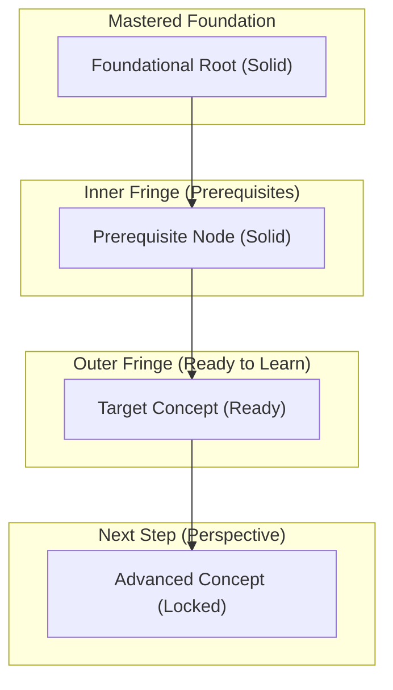

# Knowledge Atlas: {{domain}}

## 1. Planned Curriculum
- id: foundational-concept
  title: "Foundational principles establish unambiguous ground truths"
  depends_on: []
- id: derived-concept
  title: "Derived mechanisms resolve concrete tensions from foundations"
  depends_on: [foundational-concept]
- id: advanced-concept
  title: "Advanced architecture refining derived mechanisms"
  depends_on: [derived-concept]

<!-- AUTO-GENERATED HORIZON START -->
## 2. Active Frontier DAG

## 3. Domain Concepts Registry
<!-- Synchronized automatically by scripts/graph.py sync -->
- [[foundational-concept]] — Foundational principles establish unambiguous ground truths `[Ready]`
- [[derived-concept]] — Derived mechanism solving concrete limitations of foundational concept `[Locked]`
- [[advanced-concept]] — Advanced architecture refining derived mechanisms `[Locked]`
<!-- AUTO-GENERATED HORIZON END -->
