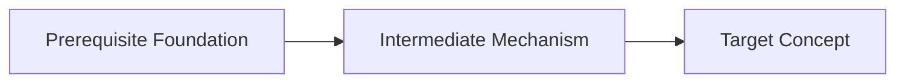

# Session: {{topic}}

> [!info] Session Overview
> **Domain:** `{{domain}}` | **Date:** `{{date}}` | **Status:** `in_progress`
> **Target Concepts:** [[{{topic_slug}}]]

## Roadmapped Plan

<!-- Live Mirroring content appends below -->

## Step 1: {{step_title}}

<!-- Problem motivation: Why did existing approaches fail? What paradox forced this insight? -->
{{step_motivation}}

<!-- Solution mechanism: How does the mechanism resolve the tension? -->
{{step_mechanism}}

> [!abstract] Core Insight
> <!-- Generating principle explained with KaTeX math and key distinctions -->
> {{core_insight}}

> [!question] Check Understanding
> <!-- Concept verification question administered via ask_question modal quiz -->
> Verified via interactive quiz.
